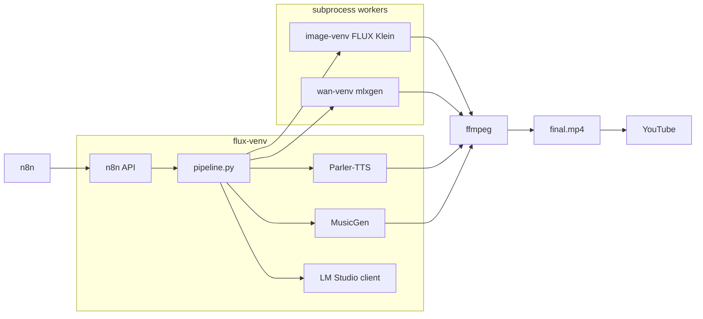

# n8n YouTube Shorts Pipeline


Automated pipeline for **kids’ YouTube Shorts**: LLM story → TTS narration → background music → AI visuals → subtitles →
final MP4. Built for **Apple Silicon (MPS)** with optional **n8n** scheduling and **YouTube upload**.

Runs fully local except for the LLM (LM Studio) and Hugging Face model downloads.

```
LM Studio (story)  →  Parler-TTS (Divya voice)  →  MusicGen
                              ↓
                    FLUX.2 Klein images  →  Ken Burns or Wan clips
                              ↓
                    ffmpeg assembly  →  final.mp4  →  n8n → YouTube
```

## Features

- **Story generation** — theme profiles (`profiles/*.yaml`), duplicate-title avoidance, optional LLM quality reviewer
- **Voice** — [indic-parler-tts](https://huggingface.co/ai4bharat/indic-parler-tts) with a fixed **Divya** storytelling
  profile (English & Hindi)
- **Music** — MusicGen instrumental bed, mixed under narration
- **Visual tiers**
    - **`flux`** — FLUX.2 Klein scene images + Ken Burns zoom (default, best balance of quality and speed)
    - **`wan`** — Wan 2.2 short motion clips via [mlxgen](https://github.com/AbstractMachines/mlx-gen) (more RAM, subtle
      motion)
- **9:16 Shorts** — 1080×1920 output with burned-in subtitles (English; Hindi skips on-screen subs)
- **n8n integration** — HTTP API with per-stage steps, 30-minute retries, video download endpoint for Docker n8n
- **Isolated GPU workers** — heavy models run in separate venv subprocesses to avoid OOM after TTS/music

## Requirements

| Component                                   | Notes                                                                |
|---------------------------------------------|----------------------------------------------------------------------|
| **macOS + Apple Silicon**                   | Primary target (MPS). Linux/CUDA may work with config tweaks.        |
| **Python 3.12**                             | `flux-venv` and `image-venv`                                         |
| **ffmpeg / ffprobe**                        | `brew install ffmpeg`                                                |
| **LM Studio** (or OpenAI-compatible server) | Local LLM at `http://127.0.0.1:1234/v1` — see `default.yaml` → `llm` |
| **Disk**                                    | ~15–20 GB for models (TTS, MusicGen, FLUX Klein; Wan adds more)      |
| **RAM**                                     | 16 GB+ recommended; Wan tier needs several GB free unified memory    |

Optional: **Docker n8n** for scheduled runs and YouTube OAuth upload.

## Quick start

### 1. Clone and create virtual environments

```bash
git clone https://github.com/YOUR_USER/n8n-youtube.git
cd n8n-youtube

python3.12 -m venv flux-venv
source flux-venv/bin/activate
pip install -r requirements.txt
deactivate

python3.12 -m venv image-venv
source image-venv/bin/activate
pip install -r requirements-image.txt
deactivate
```

**Wan tier only** (optional):

```bash
python3.12 -m venv wan-venv
source wan-venv/bin/activate
pip install mlx-gen pydantic pyyaml
deactivate

source wan-venv/bin/activate
mlxgen prepare --model Wan-AI/Wan2.2-TI2V-5B-Diffusers --path models/wan2.2-ti2v-5b -q 8
deactivate
```

### 2. Start LM Studio

Load a chat model (e.g. Llama 3.1 8B Instruct) and enable the local server on port **1234**.

### 3. Generate a video

```bash
source flux-venv/bin/activate
export TOKENIZERS_PARALLELISM=false

python -m src.pipeline --theme bedtime --lang en --duration 45 --tier flux
```

Output lands in `output/YYYYMMDD_HHMMSS_xxxxxx/final.mp4` (or `final_subtitled.mp4`).

### 4. Run the n8n API (optional)

```bash
./scripts/start-n8n-api.sh
# Health: http://127.0.0.1:8765/health
```

Import `n8n/video-pipeline-youtube.json` into n8n, set **Configure Job** paths, attach YouTube OAuth, and schedule.

---

## Video tiers

| Tier       | Visuals                                             | Best for                            | Extra setup             |
|------------|-----------------------------------------------------|-------------------------------------|-------------------------|
| **`flux`** | FLUX.2 Klein PNGs + Ken Burns                       | Daily Shorts, consistent characters | `image-venv`            |
| **`wan`**  | Wan 2.2 text-to-video (short clips, time-stretched) | Subtle scene motion                 | `wan-venv` + model prep |

```bash
# flux (default)
python -m src.pipeline --theme fantasy --lang en --duration 60 --tier flux

# wan — regenerate video only on an existing run
python -m src.pipeline --video-only --from-run output/20260630_081131_5b3138 --tier wan
```

**Note:** Voice is mixed in ffmpeg; tiers do not produce lip-sync. Wan generates ~13 frames per scene — expect gentle
motion, not full animation.

---

## Pipeline stages

Each run creates a folder under `output/{run_id}/`:

| Stage       | Artifact                            | Description                     |
|-------------|-------------------------------------|---------------------------------|
| `script`    | `script.json`                       | Title, narration, scene prompts |
| `voice`     | `voice.wav`                         | Parler-TTS (Divya)              |
| `music`     | `music.wav`                         | MusicGen background             |
| `images`    | `images/scene_*.png`                | FLUX Klein (skipped for `wan`)  |
| `clips`     | `clips/scene_*.mp4`                 | Ken Burns or Wan                |
| `video`     | `video_raw.mp4`                     | Concatenated clips              |
| `subtitles` | `clips_subtitled/`, `subtitles.srt` | Burned subs (English)           |
| `audio_mix` | `audio_mixed.wav`                   | Voice + music                   |
| `final`     | `final.mp4`                         | Muxed Short                     |

Run a single stage:

```bash
python -m src.pipeline --stage clips --from-run output/YYYYMMDD_HHMMSS_xxx --tier flux
```

---

## HTTP API (n8n)

| Method | Path              | Description                                           |
|--------|-------------------|-------------------------------------------------------|
| `GET`  | `/health`         | Liveness check                                        |
| `POST` | `/step`           | Run one stage (`{"stage": "voice", "run_id": "..."}`) |
| `POST` | `/generate`       | Full pipeline in one call                             |
| `GET`  | `/video/{run_id}` | Download final MP4 (for Docker n8n upload)            |

Step retries (API-side, for long GPU jobs):

| Env var                   | Default | Meaning                       |
|---------------------------|---------|-------------------------------|
| `N8N_STEP_MAX_TRIES`      | `3`     | Attempts per step             |
| `N8N_STEP_RETRY_WAIT_SEC` | `1800`  | Wait between retries (30 min) |

n8n’s own retry is capped at 5 seconds — use API retries for model OOM / transient failures.

---

## Configuration

All defaults live in **`default.yaml`** (validated by Pydantic in `src/config.py`).

| Section  | Key settings                                                               |
|----------|----------------------------------------------------------------------------|
| `themes` | Content types; each has a prompt profile in `profiles/`                    |
| `voice`  | Parler-TTS model + Divya voice description                                 |
| `music`  | MusicGen model, prompt, mix volume                                         |
| `video`  | Tier, resolution, FLUX/Wan model paths, Ken Burns motion                   |
| `llm`    | LM Studio URL, model name, quality reviewer (`min_score`, `max_revisions`) |

CLI overrides:

```bash
python -m src.pipeline \
  --theme joke \
  --lang hi \
  --duration 30 \
  --tier flux \
  --themes-csv "story,joke,bedtime,fantasy" \
  --no-subtitles
```

---

## Project structure

```
n8n-youtube/
├── default.yaml              # Main config
├── profiles/                 # Per-theme LLM prompts (story, fantasy, bedtime, …)
├── src/
│   ├── pipeline.py           # Orchestrator + CLI
│   ├── n8n_api.py            # HTTP API for n8n
│   ├── script_generator.py   # Two-step LLM: story → image prompts
│   ├── quality_agent.py      # Optional LLM reviewer
│   ├── tts.py / music.py     # Audio generation
│   ├── video_flux.py         # FLUX + Ken Burns
│   ├── video_wan.py          # Wan / mlxgen
│   └── assembler.py          # ffmpeg concat, mix, subtitles
├── scripts/
│   ├── start-n8n-api.sh
│   ├── run-pipeline-step.sh  # Single stage (n8n)
│   └── run-pipeline-for-n8n.sh
├── n8n/
│   └── video-pipeline-youtube.json
├── requirements.txt          # flux-venv
└── requirements-image.txt    # image-venv (FLUX / transformers 5)
```

Generated at runtime (gitignored): `output/`, `records/`, `models/`, `*-venv/`.

---

## Themes & content types

Add a name to `themes:` in `default.yaml`, then create `profiles/{theme}.yaml` with `instruction_en` / `instruction_hi`
and optional `visual_style`.

Built-in themes include: story, joke, bedtime, fantasy, adventure, dragons, hindu_god_stories, and more — see
`profiles/`.

**Configure Job** (n8n) theme priority:

1. Fixed `theme` → use that type
2. Empty/`auto` + `themesCsv` → serial rotation through CSV (state in `records/theme_rotation.json`)
3. Empty/`auto` → serial rotation through `default.yaml` `themes:` list (wraps after last)

---

## Architecture



Three Python environments exist because **parler-tts** requires transformers 4.x while **FLUX Klein** needs transformers
5.x — they cannot share one venv.

---

## Troubleshooting

| Problem                                  | Fix                                                                                                        |
|------------------------------------------|------------------------------------------------------------------------------------------------------------|
| `No module named 'yaml'` on API          | Start API via `./scripts/start-n8n-api.sh` (uses `flux-venv`)                                              |
| `python: not found` in n8n steps         | Recreate venvs after moving the project folder                                                             |
| Wan killed / OOM                         | Close apps; use `--video-only --from-run … --tier wan`; flux fallback is automatic                         |
| n8n still uses `flux` when you set `wan` | Set `tier` on **Generate Script**; later stages read `default.yaml` unless tier is stored in `script.json` |
| LM Studio errors                         | Confirm server running; check `llm.base_url` and model name in `default.yaml`                              |

See **[how-to-run.md](how-to-run.md)** for Docker n8n mounts, Configure Job fields, and move/rename checklist.

---

## License

Add your license file before publishing. Model weights (FLUX, Parler-TTS, MusicGen, Wan) are subject to their respective
Hugging Face / vendor terms.

---

## Acknowledgments

- [FLUX.2 Klein](https://huggingface.co/black-forest-labs/FLUX.2-klein-4B) — scene images
- [indic-parler-tts](https://huggingface.co/ai4bharat/indic-parler-tts) — narration
- [MusicGen](https://huggingface.co/facebook/musicgen-small) — background music
- [Wan 2.2](https://huggingface.co/Wan-AI/Wan2.2-TI2V-5B-Diffusers) + [mlxgen](https://github.com/AbstractMachines/mlx-gen) —
  optional motion clips
- [n8n](https://n8n.io/) — workflow automation  
